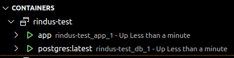
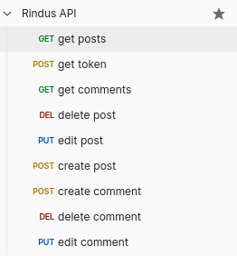

# rindus-test

## Installation
Clone code from Github, navigate to project root and execute command:
    - make start

Alternatively, you can run command 'docker-compose up' (wich is what make command does).

After this, two containers have been created and started:

- app is a pure backend API (Django and DRF)
- postgres:latest is the database.

The data has been automatically imported into the database, taking advantage of Django migrations and commands. In the other hand, user rindus (password rindus) has been also created, so ...

## Execution
Now, the API's endpoints are ready to be consumed. 

I strongly recommend to use Postman to test the API operations, this is why a json file containing a collection of Postman requests has been included in the project root path: Rindus API.postman_collection.json

API endpoints could be consumed also using other tools like curl.

First step is to get the token for user rindus:
    
Consume end point:

    http://127.0.0.1:8000/gettoken/ 
    using params:
        - username: rindus 
        - password: rindus 

A token will be sent back to you and it will be used to authenticate in the rest of the API enbdpoints.
    
if you are using Postman, right click the value of the token, set it as variable token and the requests should work because I already added to the header.

Otherwise, just add it to the request HEADER i.e.
    
    curl http://127.0.0.1:8000/comments/
        -H "Accept: application/json"
        -H "Authorization: Bearer {token}"

Now, you are ready to request CRUD operations over post and comments.